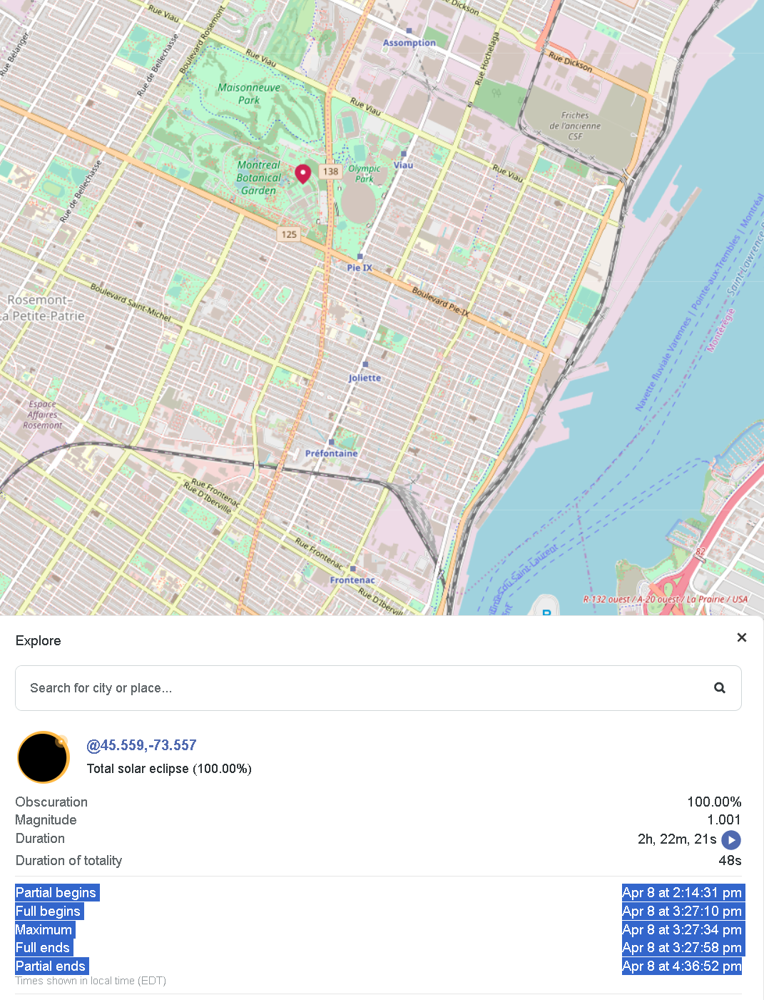

# Eclipse HDR Timelapse 

This module provides a Python script and Jupyter notebook to control a camera during the 2024 eclipse and automate a multi-exposure acquisition at pre-defined timesteps, centered on the Maximum
for your area. 

## Prerequisites

To use this module, you will need to have Anaconda installed on your system. Anaconda simplifies package management and deployment for Python and is available for Windows, macOS, and Linux.

Download and install Anaconda from [here](https://www.anaconda.com/products/individual).

## Installation

**Clone the Repository**:

Clone this repository to your local machine using:

    git clone https://github.com/Quorumetrix/eclipse_hdr_timelapse


## Create and Activate Conda Environment:
Navigate to the cloned repository directory and create a Conda environment using the provided requirements.txt file:

    cd path/to/my/folder
    conda create --name hdr_timelapse python=3.9
    conda activate hdr_timelapse
    pip install -r requirements.txt


# Start by finding the exact timing of the eclipse at your location

Find your location on the map at:
[https://www.timeanddate.com/eclipse/map/2024-april-8](https://www.timeanddate.com/eclipse/map/2024-april-8)


Copy the text as seen in the image below:



For Montreal, it would be:

- **Partial begins:** Apr 8 at 2:14:31 pm
- **Full begins:** Apr 8 at 3:27:10 pm
- **Maximum:** Apr 8 at 3:27:34 pm
- **Full ends:** Apr 8 at 3:27:58 pm
- **Partial ends:** Apr 8 at 4:36:52 pm


You must copy that text into the ECLIPSE_TEXT variable in the 'config.py' file or in the 'Eclipse HDR Timelapse.ipynb' Jupyter notebook:


```text
# Paste the text below in the triple quotation marks
ECLIPSE_TEXT = """
Partial begins
Apr 8 at 2:14:31 pm
Full begins
Apr 8 at 3:27:10 pm
Maximum
Apr 8 at 3:27:34 pm
Full ends
Apr 8 at 3:27:58 pm
Partial ends
Apr 8 at 4:36:52 pm
"""
```

## Usage

This project can be utilized either through a Python script or a Jupyter Notebook. Both methods set up a multi-exposure timelapse, but they differ slightly in how parameters are configured.

### Using the Python Script

To run the Python script,  execute the following command in your terminal or command prompt, ensuring you're within the activated Conda environment:

```bash

python eclipse_hdr_timelapse.py
```


### Using the Jupyter notebook

To run the Jupyter Notebook ,  execute the following command in your terminal or command prompt, ensuring you're within the activated Conda environment:

```bash
jupyter notebook
```

Then, locate 'Eclipse HDR Timelapse.ipynb', update the parameters in the early notebook cells, and run all cells.